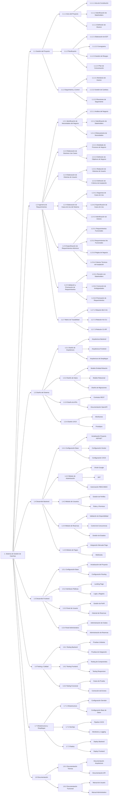

# Planificación del Proyecto: Sistema de Canchas

```mermaid
graph LR

A["1. Sistema de Gestión de Canchas"]

%% =========================
%% 1. Gestión del Proyecto
%% =========================

A --> B["1.1 Gestión del Proyecto"]

B --> B1["1.1.1 Inicio del Proyecto"]
B1 --> B11["1.1.1.1 Acta de Constitución"]
B1 --> B12["1.1.1.2 Identificación de Stakeholders"]
B1 --> B13["1.1.1.3 Definición de Alcance"]

B --> B2["1.1.2 Planificación"]
B2 --> B21["1.1.2.1 Elaboración de EDT"]
B2 --> B22["1.1.2.2 Cronograma"]
B2 --> B23["1.1.2.3 Gestión de Riesgos"]
B2 --> B24["1.1.2.4 Plan de Comunicación"]

B --> B3["1.1.3 Seguimiento y Control"]
B3 --> B31["1.1.3.1 Monitoreo de Avance"]
B3 --> B32["1.1.3.2 Gestión de Cambios"]
B3 --> B33["1.1.3.3 Reuniones de Seguimiento"]

%% =========================
%% 2. Ingeniería de Requerimientos
%% =========================

A --> C["1.2 Ingeniería de Requerimientos"]

C --> C1["1.2.1 Identificación de Necesidades del Negocio"]
C1 --> C11["1.2.1.1 Análisis del Negocio"]
C1 --> C12["1.2.1.2 Identificación de Stakeholders"]
C1 --> C13["1.2.1.3 Relevamiento de Necesidades"]

C --> C2["1.2.2 Elaboración de Business Use Cases"]
C2 --> C21["1.2.2.1 Modelado de Procesos de Negocio"]
C2 --> C22["1.2.2.2 Definición de Objetivos de Negocio"]

C --> C3["1.2.3 Elaboración de Historias de Usuario"]
C3 --> C31["1.2.3.1 Redacción de Historias de Usuario"]
C3 --> C32["1.2.3.2 Definición de Criterios de Aceptación"]

C --> C4["1.2.4 Elaboración de Casos de Uso del Sistema"]
C4 --> C41["1.2.4.1 Diagramas de Casos de Uso"]
C4 --> C42["1.2.4.2 Especificación de Casos de Uso"]
C4 --> C43["1.2.4.3 Identificación de Actores"]

C --> C5["1.2.5 Especificación de Requerimientos Atómicos"]
C5 --> C51["1.2.5.1 Requerimientos Funcionales"]
C5 --> C52["1.2.5.2 Requerimientos No Funcionales"]
C5 --> C53["1.2.5.3 Reglas de Negocio"]
C5 --> C54["1.2.5.4 Criterios Técnicos de Aceptación"]

C --> C6["1.2.6 Validación y Priorización de Requerimientos"]
C6 --> C61["1.2.6.1 Revisión con Stakeholders"]
C6 --> C62["1.2.6.2 Corrección de Ambigüedades"]
C6 --> C63["1.2.6.3 Priorización de Requerimientos"]

C --> C7["1.2.7 Matriz de Trazabilidad"]
C7 --> C71["1.2.7.1 Relación BUC-HU"]
C7 --> C72["1.2.7.2 Relación HU-CU"]
C7 --> C73["1.2.7.3 Relación CU-RF"]

%% =========================
%% 3. Diseño
%% =========================

A --> D["1.3 Diseño del Sistema"]

D --> D1["1.3.1 Diseño de Arquitectura"]
D1 --> D11["Arquitectura Backend"]
D1 --> D12["Arquitectura Frontend"]
D1 --> D13["Arquitectura de Despliegue"]

D --> D2["1.3.2 Diseño de Datos"]
D2 --> D21["Modelo Entidad-Relación"]
D2 --> D22["Modelo Relacional"]
D2 --> D23["Diseño de Migraciones"]

D --> D3["1.3.3 Diseño de APIs"]
D3 --> D31["Contratos REST"]
D3 --> D32["Documentación OpenAPI"]

D --> D4["1.3.4 Diseño UX/UI"]
D4 --> D41["Wireframes"]
D4 --> D42["Prototipos"]

%% =========================
%% 4. Backend
%% =========================

A --> E["1.4 Desarrollo Backend"]

E --> E1["1.4.1 Configuración Base"]
E1 --> E11["Inicialización Proyecto ASP.NET"]
E1 --> E12["Configuración Docker"]
E1 --> E13["Configuración CI/CD"]

E --> E2["1.4.2 Módulo de Autenticación"]
E2 --> E21["OAuth Google"]
E2 --> E22["JWT"]
E2 --> E23["Autorización RBAC/ABAC"]

E --> E3["1.4.3 Módulo de Usuarios"]
E3 --> E31["Gestión de Perfiles"]
E3 --> E32["Roles y Permisos"]

E --> E4["1.4.4 Módulo de Reservas"]
E4 --> E41["Validación de Disponibilidad"]
E4 --> E42["Control de Concurrencia"]
E4 --> E43["Gestión de Estados"]

E --> E5["1.4.5 Módulo de Pagos"]
E5 --> E51["Integración Mercado Pago"]
E5 --> E52["Webhooks"]

%% =========================
%% 5. Frontend
%% =========================

A --> F["1.5 Desarrollo Frontend"]

F --> F1["1.5.1 Configuración Base"]
F1 --> F11["Inicialización del Proyecto"]
F1 --> F12["Configuración Routing"]

F --> F2["1.5.2 Interfaces Públicas"]
F2 --> F21["Landing Page"]
F2 --> F22["Login y Registro"]

F --> F3["1.5.3 Panel de Usuario"]
F3 --> F31["Gestión de Perfil"]
F3 --> F32["Historial de Reservas"]

F --> F4["1.5.4 Panel Administrativo"]
F4 --> F41["Administración de Clubes"]
F4 --> F42["Administración de Reservas"]

%% =========================
%% 6. Testing
%% =========================

A --> G["1.6 Testing y Calidad"]

G --> G1["1.6.1 Testing Backend"]
G1 --> G11["Pruebas Unitarias"]
G1 --> G12["Pruebas de Integración"]

G --> G2["1.6.2 Testing Frontend"]
G2 --> G21["Testing de Componentes"]
G2 --> G22["Testing Responsive"]

G --> G3["1.6.3 Testing Funcional"]
G3 --> G31["Casos de Prueba"]
G3 --> G32["Corrección de Errores"]

%% =========================
%% 7. Infraestructura
%% =========================

A --> H["1.7 Infraestructura y Despliegue"]

H --> H1["1.7.1 Infraestructura"]
H1 --> H11["Configuración Servidor"]
H1 --> H12["Configuración Base de Datos"]

H --> H2["1.7.2 DevOps"]
H2 --> H21["Pipeline CI/CD"]
H2 --> H22["Monitoreo y Logging"]

H --> H3["1.7.3 Deploy"]
H3 --> H31["Deploy Backend"]
H3 --> H32["Deploy Frontend"]

%% =========================
%% 8. Documentación
%% =========================

A --> I["1.8 Documentación"]

I --> I1["1.8.1 Documentación Técnica"]
I1 --> I11["Documentación Arquitectura"]
I1 --> I12["Documentación API"]

I --> I2["1.8.2 Documentación Funcional"]
I2 --> I21["Manual de Usuario"]
I2 --> I22["Manual Administrativo"]
```